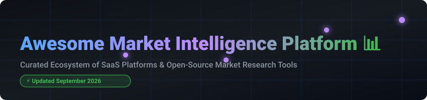

  

# 📊 Awesome Market Intelligence Platform 🚀

> **A curated, high-impact ecosystem list of top SaaS products & open-source tools for Market Intelligence, Deal Sourcing, Venture Capital, Competitive Analysis, and Business Research.** 💡

---

## 💡 Overview & Market Insights 📈

### 🌐 Market Size & Industry Dynamics
* **Estimated Global Market Size:** The global market intelligence & business data industry is valued at **~$82.5 Billion** (2025/2026) and is projected to surpass **$140+ Billion by 2032**, driven by enterprise AI adoption, automated deal sourcing, and real-time data integration. 💰
* **Market Structure & Fragmentation:** The sector is **moderately fragmented**. While legacy giants like ZoomInfo, AlphaSense, and PitchBook dominate high-end private equity and enterprise sales intelligence, specialized market radar tools, regional data platforms, and open-source entity extraction pipelines maintain strong operational niches. 🏢

---

## 📑 Table of Contents 📌

- [🏢 SaaS / Commercial Platforms](#-saas--commercial-platforms)
- [🔓 Open-Source GitHub Projects](#-open-source-github-projects)
- [🤝 How to Contribute](#-how-to-contribute)
- [💖 Support & Sponsorship](#-support--sponsorship)
- [📈 Star History](#-star-history)
- [⚖️ Disclaimer](#%EF%B8%8F-disclaimer)

---

## 🏢 SaaS / Commercial Platforms

Below is a breakdown of top commercial market research, company data, and deal intelligence platforms, sorted by estimated company scale (valuation / enterprise size descending). 📊

| 🏢 Platform | 📝 Description & Focus | 💰 Starting Tier Price | 🎁 Free Tier / Free Trial Limits | 📏 Enterprise Size / Valuation |
| :--- | :--- | :--- | :--- | :--- |
| **[ZoomInfo](https://www.zoominfo.com/)** 🚀 | Enterprise B2B intent data, company contacts, and go-to-market intelligence. | **~$15,000 / year** (Professional Tier starting rate) | **14-Day Free Trial** (Limited contact reveal credits & search results) | **~$20.7B Valuation** (Public TTM Revenue ~$1.2B) 🏛️ |
| **[AlphaSense](https://www.alpha-sense.com/)** 🔍 | AI market research platform indexing SEC filings, transcript search, and broker research. | **~$10,000 / year** (Single user starter tier) | **7-Day Free Trial** (Restricted document downloads & export features) | **$7.5B Valuation** (ARR ~$600M+) 💎 |
| **[PitchBook](https://pitchbook.com/)** 📈 | Premier private capital, PE, VC, M&A transactions, and startup deal sourcing database. | **~$24,000 / year** (Base user license rate) | **7-Day Free Trial** (Preview mode with locked export & contact privileges) | **$4.5B+ Valuation** (Subsidiary of Morningstar, 2024 Rev $618M) 🏛️ |
| **[Similarweb](https://www.similarweb.com/)** 🌐 | Digital web traffic, mobile app benchmark analytics, and online competitive intelligence. | **$125 / month** (Starter plan billed annually) | **7-Day Free Trial** & **Free Tier** (Limited to 3 months of historical data & 5 website results) | **~$1.6B Valuation** (Public 2025 Revenue $282.6M) 📊 |
| **[CB Insights](https://www.cbinsights.com/)** 🔮 | Technology market intelligence, startup exit predictions, and tech ecosystem mapping. | **~$20,000 / year** (Essentials tier starting rate) | **7-Day Free Trial** (Basic dashboard preview, non-exportable research) | **~$1.0B Valuation** (~$100M ARR) 🦄 |
| **[GlobalData](https://www.globaldata.com/)** 🌍 | Sector intelligence, thematic research, financial dataset feeds, and macroeconomic data. | **~$5,000 / year** (Single sector package rate) | **7-Day Free Trial** (Limited sample research reports & dataset views) | **~$900M Market Cap** (Public LSE: DATA, Revenue £322M) 🏛️ |
| **[Crunchbase](https://www.crunchbase.com/)** ⚡ | Global database for private startup funding, investor portfolios, and business signals. | **$49 / month** (Starter Pro tier billed annually) | **7-Day Free Trial** (Free tier limits searches to 5 results per query, no CSV exports) | **~$150M Market Cap / Valuation** (~$50M ARR) 🚀 |
| **[Tracxn](https://tracxn.com/)** 🕵️‍♂️ | Emerging tech tracker, global VC deal sourcing, and sector market landscape maps. | **$300 / month** (Billed annually per user seat) | **7-Day Free Trial** (Limited to 10 company profile views) | **~$40M Market Cap** (Public NSE/BSE, Revenue ~₹84 Cr) 🇮🇳 |
| **[Owler](https://www.owler.com/)** 📣 | Firmographic data, community company revenue insights, and news alerts. | **$35 / month** (Pro tier starting rate) | **Free Forever Plan** (Allows up to 5 company tracking profiles & basic alerts) | **~$25M Valuation** (Acquired by Meltwater, Revenue ~$4M) 🏢 |
| **[Dealroom](https://dealroom.co/)** 🇪🇺 | European startup ecosystem intelligence, funding datasets, and innovation graphs. | **€300 / month** (Professional seat starter) | **7-Day Free Trial** (Restricted to basic ecosystem lookup, 5 exports) | **~$15M Valuation** (Revenue <$10M) 🇪🇺 |

---

## 🔓 Open-Source GitHub Projects

Explore open-source alternatives, dataset parsers, and intelligence frameworks. Repositories are sorted by GitHub Stars_Counts (descending). 🌟

| 📦 Repository & Tool | 📝 Description | 🌟 Stars_Count Badge |
| :--- | :--- | :--- |
| **[SpiderFoot](https://github.com/smicallef/spiderfoot)** 🕷️ | Automated OSINT reconnaissance framework for company, IP, domain, and entity intelligence. |  |
| **[theHarvester](https://github.com/laramies/theHarvester)** 🌾 | OSINT tool for gathering company emails, subdomains, employee names, open ports, and banners. |  |
| **[edgartools](https://github.com/dgunning/edgartools)** 📜 | Python toolkit for parsing SEC EDGAR public company filings, 10-K/10-Q financial statements, and insider trades. |  |
| **[OpenCorporates API Tools](https://github.com/api-evangelist/open-corporates)** 🏛️ | Open company registry tools and API definitions for querying global firmographic registries. |  |
| **[OpenStock](https://github.com/Open-Dev-Society/OpenStock)** 📈 | Open-source stock market and financial intelligence platform for real-time company insights. |  |
| **[YC Open Source Companies](https://github.com/yc-oss/open-source-companies)** 🚀 | Comprehensive dataset of open-source startups funded by Y Combinator. |  |
| **[AI Startup Market Intelligence](https://github.com/ramilyabm/AI-Startup-Market-Intelligence)** 🤖 | Market research database tracking funding rounds, ARR, and valuation data for AI startups. |  |

---

## 🤝 How to Contribute 🛠️

1. **Fork** the repository 🍴
2. **Add/Edit** entries in `README.md` following the tabular schema.
3. Ensure **pricing**, **free tier limits**, and **Stars_Badges** follow the established structure.
4. **Submit a PR** with a clear description of changes! 🚀

---

## 💖 Support & Sponsorship ☕

If you find this market intelligence resource useful, consider supporting the project! Your support keeps this ecosystem list updated and helps fund continuous data curation. ✨

* 🌟 **Star this repository** to help others discover it!
* 🔀 **Fork** and contribute your favorite market intelligence tools.
* ☕ **Buy me a coffee / Sponsor on GitHub:**  
  

---

## 📈 Star History

---

## ⚖️ Disclaimer 🛡️

* This list is **community-curated** for educational, investment research, and informational purposes.
* All trademarks, brand names, and logos belong to their respective owners.
* Scraping and redistributing proprietary database contents must adhere to source terms of service and applicable compliance regulations. 

---

  <b>Built with ❤️ for investors, strategists, software engineers, and market researchers worldwide.</b>

